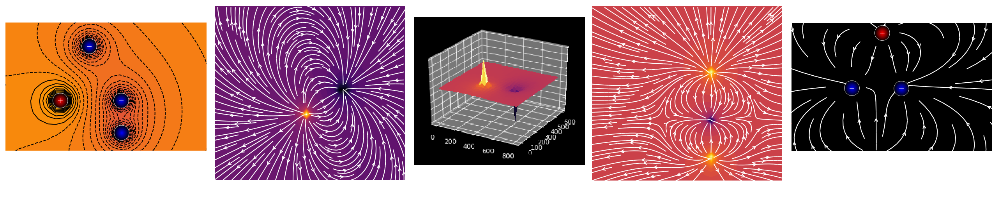

Este simulador de campo electrico es un programa diseñado para facilitar el modelado de situaciones que involucren cargas puntuales en Python.

# SIMULADOR
Se trata de un programa que simula el movimiento de cargas dentro de un campo creado por el empleador. Podrá encontrar extensiones 
con las cuales interactuar.

## TABLA DE CONTENIDO

- FUNCIONAMIENTO
  - CARGAS Y BOTONES
  - CAMPOS
  - PANTALLAS
- DEPENDENCIAS Y REQUISITOS
  - DEPENDENCIAS
  - REQUISITOS
- INSTALACIÓN

## Funcionamiento
Empleando la ley de Coulumb se determina la fuerza que ejercen las cargas estacionarias sobre las cargas de prueba (estas seran 
explicadas más adelante), y usando la ley de Newton se establece la aceleración con la cual se moveran estas ultimas, mostrando 
así el movimiento que estas tendrán dependiendo del punto y la cantidad de cargas estacionarias puestas.

Sobre la pantalla de inicio encontrará 3 opciones, donde podrá escoger entre ingresar directamente al simulador con la pantalla 
vacía, mirar las instrucciones (lo cual también podrá hacer más adelante ) o elegir entre 3 de las diferentes configuraciones
de cargas ya establecidas. Además esta la opción de ver los campos tanto eléctrico como potencial de la configuración 
correspondiente que se encuentre sobre la pantalla.

 ### CARGAS Y BOTONES
   Existen dos tipos de cargas, las cargas estacionarias y las de prueba, las primeras crean el campo eléctrico que interactuará 
    con las segundas, provocando su movimiento. Se aclara que las cargas de prueba son las únicas con la facultad de moverse sobre 
    la pantalla. 
    
   Tanto las estacionarias como las de prueba podrán ser positivas como negativas, incluso neutras si su valor de carga es igual
    a cero. Para establecerr el valor de la carga es necesario insertarlo en el recuadro denominado cargas, si se desea que esta sea
    negativa es necesario colocar el signo menos ("-" ). Para establecer la velocidad estan dispuestos dos recuadros, donde el 
    primero es el componente x de la velocidad, y el segundo su componente en y. Si en algunos de estos recuadros no se inserta un
    valor, se tomará este como cero.
    
   Para insertar una carga, independientemente del tipo que sea, primero debe darse click sobre la carga que desea incorporar y 
    después dar click sobre el punto de la pantalla donde desea que aparezca. Cabe recordar que las cargas con signo opuesto
    se atraen y las de signo igual se repelen.
    
   Entre los botones encontrará:
    
   - Retornar: Elimina la ultima carga insertada a la pantalla.
   
   
   - Limpiar: Elimina todas las cargas presentes en la pantalla.
   
   
   - Carga de Campo: Permite generar una carga de campo en la pantalla.
   
   
   - Carga de prueba: Permite generar una carga de prueba en la pantalla.
    
   
   - Detector: Permite fijar la posición, el potencial y campo en un punto de interes.
    
   
   - Campo: Inserta un campo eléctrico correspondiente a la configuración de cargas. Para quitarlo debe oprimirse de nuevo sobre el. 
   
   - Potencial: Inserta un campo potencial correspondiente a la configuración de cargas. Para quitarlo debe oprimirse de nuevo 
    sobre el.
   
   
   - Tecla q: Para salir al inicio.

 ### CAMPOS
   Como se ha indicado anteriormente, es posible observar el campo tanto eléctrico como potencial que crean las cargas 
   estacionarias haciendo unicamente click sobre el recuadro con el respectivo nombre.
   El campo eléctrico consiste en un mapa compuesto de flechas que indican la dirección que tomaran las cargas de prueba
   positivas sobre ese punto especificamente, en caso de ser negativas tomaran la dirección contraria indicada por la 
   flecha.
    
    
   El campo potencial consiste en un mapa compuesto por lineas de contorno que representan los puntos donde el potencial
    es igual. 
   Si los campos estan activados estos se actualizaran cada vez que se inserte una nueva carga estacionaria.
 ### PANTALLAS
   En la opción pantallas, que aparece en la pantalla de inicio, encontrará 3 tipos de configuraciones de cargas diferente.
  
     
## DEPENDENCIAS Y REQUISITOS
### DEPENCENCIAS:
* [Python](https://www.python.org/downloads/)(>= 3.6)
* [Matplotlib](https://matplotlib.org/) (= 3.2.2)
* [NumPy](https://numpy.org) (>= 1.15)
* [PyGame](https://www.pygame.org/download.shtml) (= 1.9.6)
* [setuptools](https://setuptools.readthedocs.io/en/latest/)

## INSTALACIÓN
El proyecto lo podrá encontrar en PyPI, desde donde es posible descargarlo. Lo podrá ejecutar desde la consola corriendo
el archivo " Simulador de cargas".

El link del proyecto en PyPI es el siguiente:
<https://test.pypi.org/project/Simulador-de-campo-electrico/0.0.1/#description>
La ruta para descargar el proyecto es la siguiente, para instalarlo debe ponerse en la consola:
#### 
    pip install -i https://test.pypi.org/simple/ Simulador-de-campo-electrico==0.0.1
Una vez hecho esto el programa se podrá ejecutar desde la consola yendo a la carpeta SIMULADOR y escribiendo:
#### 
    python SIMULADOR.py
Una vez hecho esto se abrirá la ventana principal del programa. Es de aclarar que según como se tenga configurada la versión de Python3 esta instrucción puede variar a:
#### 
    python3 SIMULADOR.py
Si está interesado en contribuir al desarrollo del simulador, ejecutando el último código fuente, o simplemente desea construir todo usted mismo desde la fuente.
La forma más fácil de obtener la última versión de desarrollo para comenzar a contribuir es ir al repositorio de git y ejecutar:
#### 
    git clone https://github.com/Ceratoide/CARGAS.git
De esta manera usted tendrá acceso a los modulos del proyecto.

## Autores
- Jean Pierre Cifuentes Salazar <bcifuentes@unal.edu.co>
- Juan Diego Zuniga Vargas <jzunigav@unal.edu.co>
